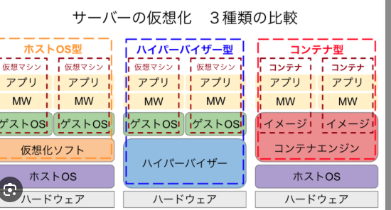
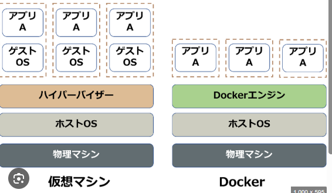

➀05_TypeScriptのフォルダ作成
➁直下にscript.tsファイル作成
③script.tsファイル内へ以下を書き込み
const message: string = "HelloWorld"
console.log(message)
// tsc script.ts  js生成 tsは人間語
// node script.js js実行 jsは機械語
// 裏技エクスポート。使用しない方が良い
④統合ターミナルで以下コマンド実行
1 tsc script.ts --outDir dist
2 node .\dist\script.js

バーチャルボックスを仕事で使うならvagrantを使うことが推奨。

KVN(カーネル-based virtualmachine)
kvmを簡単に使うためのコックピット（サーバーマシンのヘルスチェック用）
osに入れて仮想マシンを立てていた。

# VM
「サーバー特化」=「Aurora（Amazon Aurora）」＋「Rocky Linux」

汎用=ubuntsu

WSL2 (Windows subsystem )
ハイパーパイザー：仮想マシンを立てるためのソフトウェア

hypervisorのイメージ

dockerのイメージ

間にOSを挟まなくても動作し、アプリ間の連携はないため、セキュリティを確保することができる。

hypervisor型を使って仮想環境を実現する。

