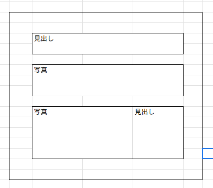

11/19 

# 使用ツール

- さくらエディター

# 概要

**HTML**
→テキストにタグと呼ばれる印をつけて、それぞれの部分が何であるかを明示する。

**CSS**
→HTMLの印によって示された各範囲の表示方法を指定する。

イメージ画像①：

ブロックという要素で管理し、ブロックの中にブロックを入れることや、ブロック同士を横に並べたりすることができる。

htmlのフォーマットは下記

<!DOCTYPE html>
<html lang="ja">
<head>
<meta charset="UTF-8">
<title></title>
</head>
<body>
</body>
</html>

---

## 2. HTMLの書き方
1. 基本は囲む
     <h1>OO</h1>
    2. <body>   この中に、コードを記載する。  </body>
    
    ※1. bodyの外に書いても問題はないが、文字の大きさなどが適用されない。