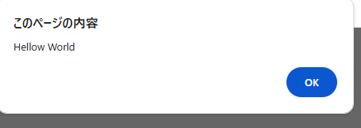

C:/users/25r1116/documents/study/%E6%8E%88%E6%A5%AD%E7%94%A8/javascript/index.html

# Javascript(対話型インタプリタ)

## コンソール出力
console.log('Hello World')

## HTMLに出力
document.writeln('Hello Javascript')
※lnは改行


## アラートを表示する命令
alert('Hellow World')



## 変数の代入
let str ='Hello Javascript'  
console.log(str)


結果
```
Hello Javascript
```

新しい言語を学ぶ際は、パラダイムを見るといい
・

リアクト