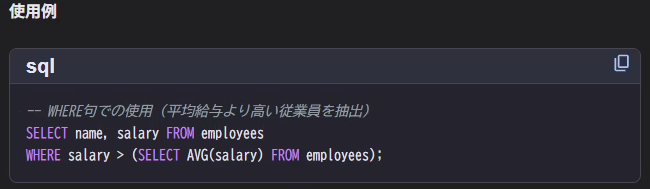

**クエリ（query）とは、「データベースに対して行う質問・命令」**のことです。

## SQLでのクエリ例
### ① データを取得する（検索）
SELECT * FROM personal;

意味：
👉「personalテーブルの中身を全部見せて」

### ② 条件付きで取得
SELECT * FROM personal WHERE age >= 20;

意味：
👉「20歳以上の人だけ見せて」

### ③ データを追加
INSERT INTO personal (name, age) VALUES ('田中', 25);

意味：
👉「田中さん（25歳）を追加して」

### ④ データを更新
UPDATE personal SET age = 26 WHERE name = '田中';

意味：
👉「田中さんの年齢を26に変えて」

### ⑤ データを削除
DELETE FROM personal WHERE age < 18;

意味：
👉「18歳未満のデータを消して」

--- 

## サブクエリ
サブクエリとは？

**サブクエリ（subquery）**とは
👉 **「クエリの中に書く、別のクエリ」**のことです。

つまり

質問の中に、さらに質問が入っている状態
日本語にするとこんな感じ👇

「平均年齢より年上の人を取得したい」

これを分解すると
1️⃣ 平均年齢を求める
2️⃣ その平均年齢より年上の人を探す

この ①がサブクエリ です。

単位値サブクエリ：1つの値のみを返す。
複数行サブクエリ：1列の複数行を返す(IN,ANY,ALL演算子と組み合わせる)
相関サブクエリ：メインクエリの各行を参照し、行ごとにサブクエリを実行する

サブクエリをデータとして置いておいて、あとで取りに行くことができる。

サブクエリが使われる場所
① WHERE句（いちばん多い）
SELECT *
FROM personal
WHERE department_id = (
    SELECT id
    FROM department
    WHERE name = '営業'
);

👉「営業部の人を取得」

② SELECT句
SELECT
  name,
  (SELECT AVG(age) FROM personal) AS avg_age
FROM personal;

👉 各行に平均年齢を表示（※全行同じ値）

③ FROM句（ちょっと上級）
SELECT avg_age
FROM (
    SELECT AVG(age) AS avg_age
    FROM personal
) t;

👉 サブクエリを一時テーブルのように使う

サブクエリの種類（重要）
🔹 スカラーサブクエリ

→ 結果が1つの値

WHERE age > (SELECT AVG(age) FROM personal)

🔹 複数行サブクエリ

→ 複数の値を返す

WHERE department_id IN (
    SELECT id FROM department
);