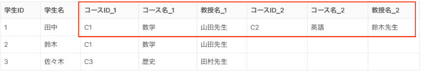
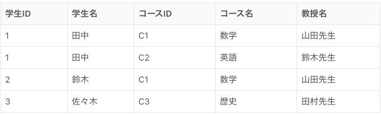
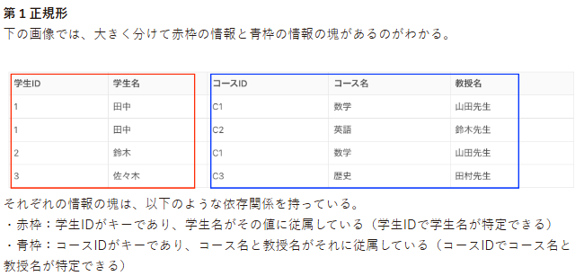
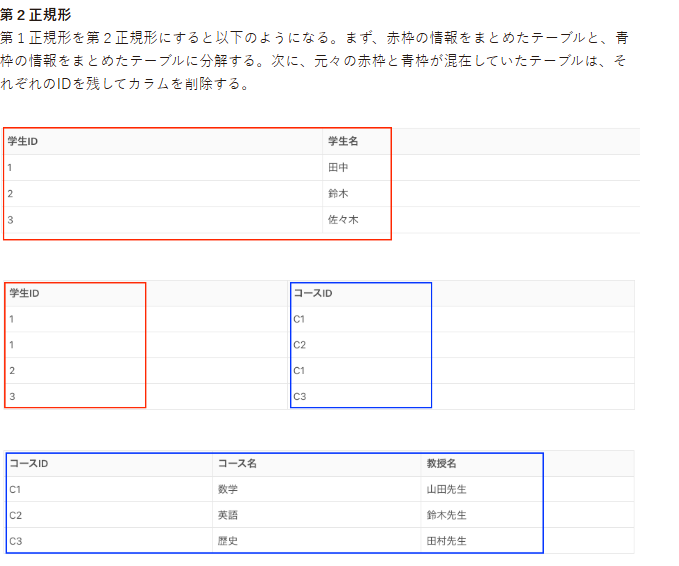
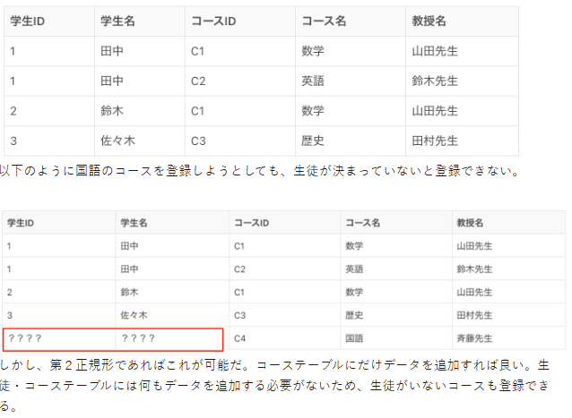
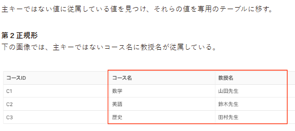
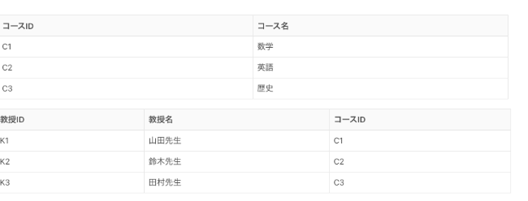
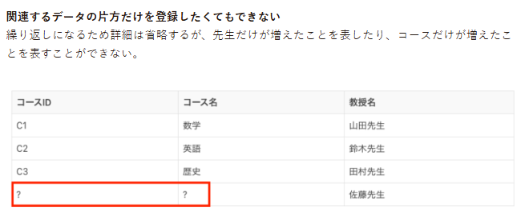

## 第一正規化
第１正規形にするためには、一つのレコード（行）に重複したデータがない状態を作る。そのため、もし重複データがあった場合は、行を分ける対応をする。

## 第二正規化
主キーの一部への依存関係をなくす。これを専門用語では部分関数従属性をなくすと言う。

第二正規化をしなければ困ること。

## 第三正規化
正規化の３つ目のステップでは、主キーではない項目への依存関係をなくす。これを専門用語では推移関数従属性をなくすと言う。

第３正規形  
第２正規形を第３正規形にするには以下の手順を踏む。  
①コースに従属している教授名を別のテーブルに移す。  （教授テーブル
②それぞれのレコードにIDを付与する。  
③教授テーブルにコースIDを追加する。（もしくは反対に、コーステーブルに教授IDを追加する）

第３正規形じゃないと困ること

## ４ あえて正規化をしない事例２選

ここではあえて正規化しない例を紹介する。あえて正規化をしないパターンを認識することで、データに対する認識が豊かになり、実践でも正規化ありきではない柔軟な視点から設計できるようになり、スキルの幅がより一層広がると思う。

基本的に正規化をしない時というのは、以下のようなメリットを求めている時だ。
・データの取得処理が大幅に簡単になる
・DBでの計算処理が減るためパフォーマンス的にプラスに働く

### ４−１ 集計対象のデータ量が非常に多く、リアルタイム性が求められないデータ
集計対象のデータ量が非常に多い、かつそのデータ自体にリアルタイム性が求められないものも正規化をしない場合がある。そうすることで、以下の２つの利点があるからだ。

例えば、ECサイトでの月次売上の数字をレポートする機能などが挙げられる。例えば以下のような商品テーブルと売上テーブルを持つECサイトを考えてみよう。

### ４−２ 書き込みがあまりなく、読み込み速度をとにかく重視したい場合
DB自体への書き込みがあまりなく、読み込み速度を重視する場合にあえて正規化しない場合がある。

例としてログデータが挙げられる。ログデータは普通更新されない。また、作成（DBへの書き込み）タイミングも「１日１回」や「数時間おき」などの特定の間隔だけだ。

さらに、ログの解析には読み込み速度が重視される。例えば筆者がサイトユーザの利用ログからサイトの改善案を企画していた時がある。その際はさまざまなログデータをもとに、複数の切り口で分析していた。そのため、ログの検索クエリ（SQL発行）結果が早くわかればわかるほど、一定の時間内で検討できる切り口の数が増えるため、読み込み速度はかなり重視していた。
